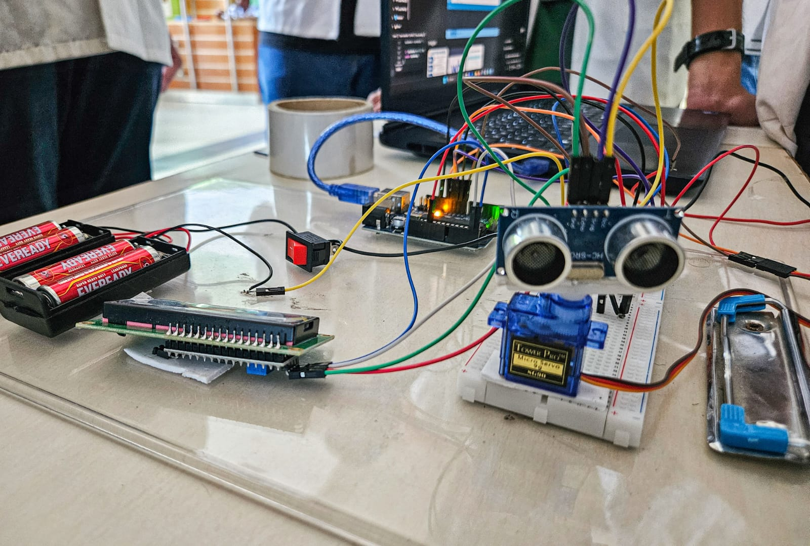
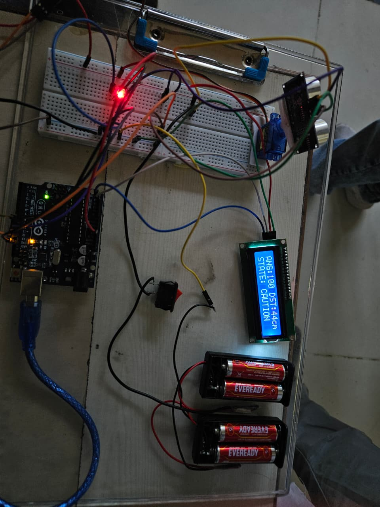
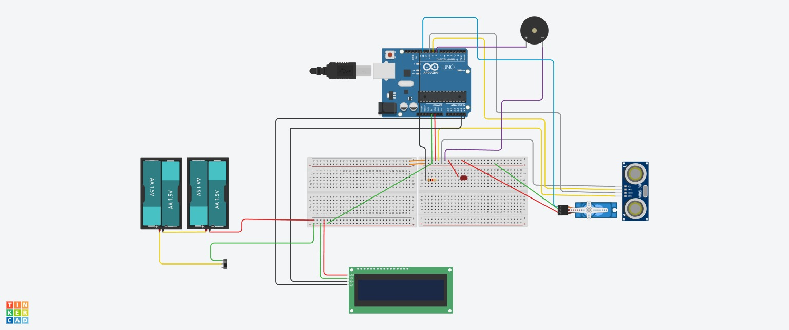

# Radar System Using Arduino UNO

> Arduino-based embedded system project demonstrating real-time sensing and multi-output coordination.

Real radar uses radio waves. This project simulates radar using sound.

Built using an Arduino UNO, ultrasonic sensor, and a rotating servo, this system scans ~150° in real time, classifies object proximity into four alert levels, and triggers synchronized visual, audio, and display outputs.

---

## Demo

🎥 Click the image below to watch the working model

> LCD showing: `ANG:100 DST:44cm STATE: CAUTION`  
> Sweep range: ~150° | Real-time scanning (approximate)
---

## Why This Project Matters

This project demonstrates how sensing, control, and feedback systems can operate together in real time. Rather than isolated components, this behaves as a coordinated embedded system — where one input drives multiple synchronized outputs in real time.

---

## How It Works

The HC-SR04 ultrasonic sensor is mounted on a servo motor that sweeps from 15° to 165° continuously — back and forth — enabling repeated scanning of the environment. At each angle, the sensor emits an ultrasonic pulse and measures the echo return time. The Arduino uses this duration to calculate distance and classifies it into one of four proximity levels, each triggering a distinct alert state across all outputs simultaneously.

---

## Proximity Levels

| State   | Distance  | LED Behavior        | Buzzer Frequency |
|---------|-----------|---------------------|------------------|
| DANGER  | 0–15 cm   | Fast blink (80ms)   | 1200 Hz          |
| WARNING | 15–30 cm  | Medium blink (150ms)| 800 Hz           |
| CAUTION | 30–50 cm  | Slow blink (300ms)  | 500 Hz           |
| SAFE    | > 50 cm   | OFF                 | OFF              |

> Frequency and blink rates are designed to create a perceptible gradient of urgency — closer objects produce faster and higher-pitched alerts.

---

## Hardware Components

| Component              | Specification          | Qty |
|------------------------|------------------------|-----|
| Arduino UNO            | ATmega328P             | 1   |
| Ultrasonic Sensor      | HC-SR04                | 1   |
| Servo Motor            | SG90 / compatible      | 1   |
| LCD Display            | 16x2 with I2C (0x27)   | 1   |
| LED                    | Red, 5mm               | 1   |
| Buzzer                 | Active/Passive         | 1   |
| Resistor               | 220Ω (for LED)         | 1   |
| Battery Holders        | 4x AA each (~6V total) | 2   |
| Breadboard             | Full-size              | 2   |
| Jumper Wires           | M-M, M-F               | —   |

---

## Pin Connections

| Component         | Arduino Pin |
|-------------------|-------------|
| HC-SR04 TRIG      | D10         |
| HC-SR04 ECHO      | D11         |
| Servo Signal      | D12         |
| Buzzer            | D8          |
| LED               | D9          |
| LCD SDA (I2C)     | A4          |
| LCD SCL (I2C)     | A5          |
| VCC (Sensor/LCD)  | 5V          |
| GND               | GND         |

> External battery supply (~6V regulated) powers the Arduino via the DC barrel jack.

---

## Circuit Diagram

---

## Libraries Required

Install via Arduino IDE → Sketch → Include Library → Manage Libraries:

- `Servo` — built-in, no install needed  
- `Wire` — built-in, no install needed  
- `LiquidCrystal_I2C` by Frank de Brabander  

---

## Setup Instructions

1. Wire components as per the pin table above  
2. Install the `LiquidCrystal_I2C` library in Arduino IDE  
3. Upload `radar_system.ino` to your Arduino UNO  
4. Open Serial Monitor at **9600 baud** to verify angle/distance output  
5. Optionally connect a Processing radar visualizer for the sweep display  

### Serial Output Format
angle,distance

Example: `90,32.`

---

## Radar Visualization

A Processing-based radar visualizer was used to render the real-time sweep display. It reads the `angle,distance.` serial stream and maps object positions onto a radar-style screen — showing detection angle and distance visually as the servo sweeps.

---

## Porting to ESP32

This project can be adapted for ESP32 boards with the following changes:

| Item               | Arduino UNO              | ESP32                         |
|--------------------|--------------------------|-------------------------------|
| Servo library      | `Servo.h`                | `ESP32Servo.h`                |
| I2C LCD pins       | A4 (SDA), A5 (SCL)       | GPIO 21 (SDA), GPIO 22 (SCL) |
| PWM pins           | Any digital              | Use PWM-capable GPIO pins     |
| Serial baud        | 9600                     | 9600 or higher                |

> Note: ESP32 operates at 3.3V logic. Verify HC-SR04 and LCD module voltage compatibility, or use level shifters if needed.

---

## Known Limitations

- Reliable detection range: up to ~100 cm (HC-SR04 hardware limit)  
- Narrow ultrasonic beam (~15°) may miss small or angled objects  
- Not a true radar — uses sound (ultrasonic waves), not radio waves  
- Servo sweep speed affects detection refresh rate; adjust `delay(50)` in code as needed  

---

## What We Learned

- Measuring echo return time and calculating distance on a microcontroller  
- Real-time multi-output coordination across display, audio, and visual alerts  
- Serial communication between hardware and a PC-based visualizer  
- Circuit debugging — where wiring faults and logic errors often produce identical symptoms  

---

## Team

Built as a physics mini-project by:

- [Animesh Kumar](https://www.linkedin.com/in/animesh-kumar-1979b236b/)  
- Subrat Yadav  
- Sayan Latua  
- Yodhajit Bhattacharjee  
- Abhyudaya Jamwal  
- Rudra Prakash Singh  
- Rudra Singh  

---

## License

MIT License — free to use, modify, and build on.
